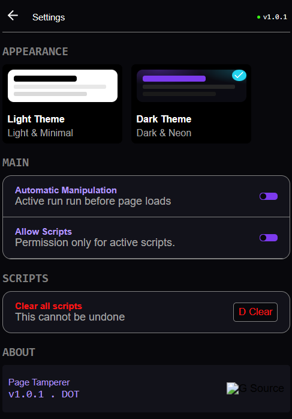
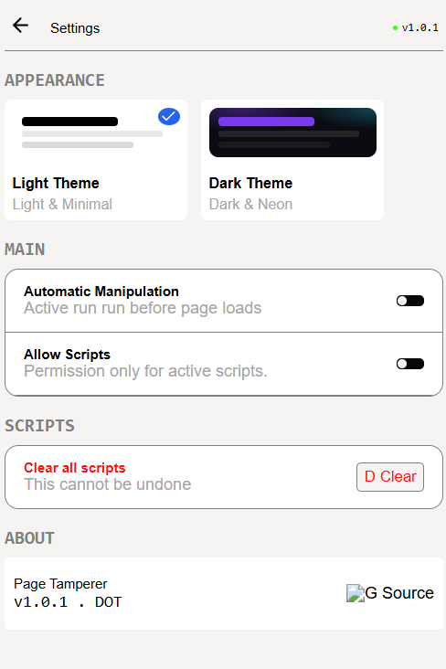
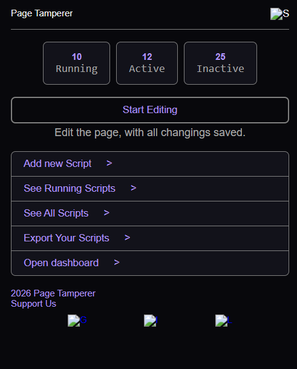
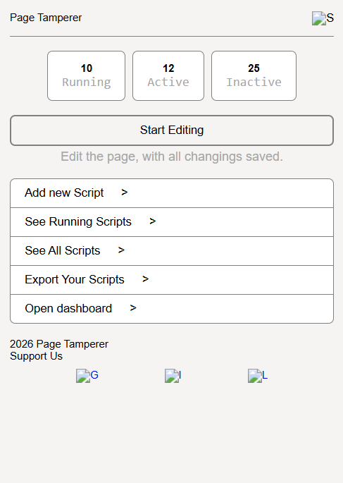
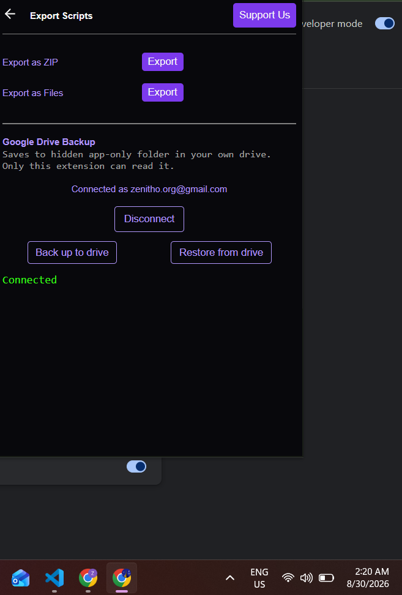

# Page Tamperer
## Motivation and the Story
At start of this year, our teacher gave us assignments on an external platform, google teach to get this achievement done by next class, but he said that you have to complete this one day before class as the achievement had date with it. Me being a procrastinator I did not bother but then on class day I get to know it has marks in final grade. I could not do anything at that as it was already the day to check. I knew about the inspect of website so I did that and was all free, as I did not think he would reload, who does that. Well, he was checking with reloads but I did not know that until my fellow classmate got caught and I was like hell, nothing can be done. But I knew there would be some solution out there. I opened gpt, explained that I need to modify a site before its loaded and that's when I got to know about injecting scripts into sites, well it directed me to **Page Tamperer** a chrome extension for loading scripts as page loads. Well, it was just simple content change script so I inspected element got the container number and changed the date, but it did not work as I used last child as selector and it should have been first child well I did figure that out just in time like it was my turn next when it finally succeeded. Well, it got me curious about this and I wanted something like the inspect that what if there is a tool where I click inspect and it saves the changes instead of writing and debugging a js script so I created this page tamperer which allows css scripts and live edit along with the js scripts. That's the story of my first extension and this extension in particular.
## Tech
This extension is created using html, css and javascript. For storage we are using the local storage, I created a separate utility for it to save and fetch from the storage to make things easier. Everything is key stored like the dictonaries in python or maps in general.
## Features
 - It allows to store scripts so they persist and do not vanish as browser is reopened.
 - It allows css and js scripts for modification of the corresponding site.
 - It also allows to disable a script so it does not run but still keeps it saved. Deletion permanently deletes it.
 - It has a live edit option that works for sites and elements that do not have changing and dynamic classes.
 - It has two themes, light and dark.
 - You can also download your scripts as zip files or simple files including the ones created during live edit. Those are json objects of the things changed.
 - You can also back up your scripts to your drive, as it is not uploaded yet so you can only use test emails for upload.
### Test email for Drive
Email: pagetamperer@gmail.com
Password: page@tamperer123
Note that using drive backup will take local storage's current scripts and push to drive replacing any other. And restore takes anything from drive and pushes to local storage's current scripts. So your current scripts might be deleted in doing so, or the backup if you clicked the wrong button. Configuring what to upload and what to restore is **not implemented**.
## Features that do not work fully:
 - The force show is under development, it does not work sometimes as intended.
 - The input only allows a fixed characters input that can be visible on the screen. I added a typearea but it does not behaves correctly. Still working on it.
 - For live edit, it has selective options of modifications only. And the selector might not work as most website's structure change on reload.
 - The scripts are stored with respect to host instead of full url so they also try to apply the changes on other pages, although they were made on a specific page.
## Features not implemented:
 - Using a same script on multiple sites with regular expressions matching.
 - Downloading single or selective scripts
## How to use
- Download the code folder from the repository by cloning like this
```bash
git clone https://github.com/mohammad-ans/page-tamperer.git 
```
 or simple download. You can also download the zip from the release. Unzip it if you downloaded a zip.

- Open chrome browser and go to ```chrome://extensions```. 
- Turn on developer options in chrome extensions. 
- Click Load unpacked option and select the main folder(if zip selected the unzipped folder).
- Now you can see and open the extension from the extensions icon on home page.(reload any website if it was open before extension was loaded)
- Enable the desired live edit options in the settings.
- Click live edit on a real website, click any element and an edit panel will appear with the selected options.
- Make any edits and save script. Also see instructions below
- For other options like add script by uploading, export scripts, see scripts all the options are listed on the home page
### Instructions to use
- When the extension is first loaded or updated after making changes, then page must be refereshed before doing live edit.
- Max 5 options can be selected for the live edit at a time.
- Some websites use dynamic classes very common with react sites. Live edit changes will not persist in such cases as selector will change so the previous edit will be invalid.
- Some elements have overlay, so try to use the remove option to remove the overlays and edit something beneath it
- The live edit is still in development meaning its not perfect.
## Journey and what I learned
Well first of all I learnt about extensions, how to debug them as I had to change dom elements themselves first to know about the logs, then I found about the extensions inspect window that made things easier. And then there are how browsers work like chromium based browsers and the others, how permissions works for extensions and what and I cannot do in extensions. I also learnt about the manifest files like how to structure though my formatting of data is real bad due to the pythonic ways. As for the tech I know already about html, css and javascript but I never kinda worked with local storage except some minor token storage or dataset, so some learnings about it as I had to find about storage ways and chrome's local storage for it, 
### AI Usage
AI was used to get generate a color palette and svgs in the website that are 7 in total ig, and give some design inspirations. I did not choose any of those designs but built my own that was by taking inspiration from it but with mainly my design focus. Other than that there might be some questions on how things work that was asked from AI, nothing else. And yepp its mostly black and white site kinda so ig I did not even use much of its color palette.
## Video

https://github.com/user-attachments/assets/c9ba9010-db8e-4aa3-a22f-4bf785ef1ce0

## Images





